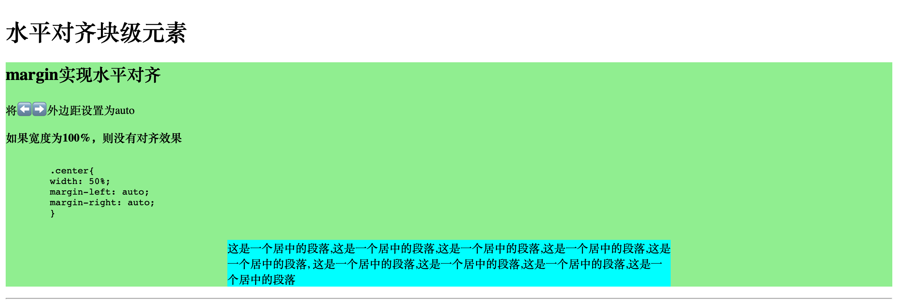

# CSS 水平对齐

Table of Contents
=================

   * [CSS 水平对齐](#css-水平对齐)
      * [margin实现水平对齐](#margin实现水平对齐)
      * [position进行左右对齐](#position进行左右对齐)
      * [float进行左右对齐](#float进行左右对齐)
      
      

## margin实现水平对齐

## position进行左右对齐

## float进行左右对齐

