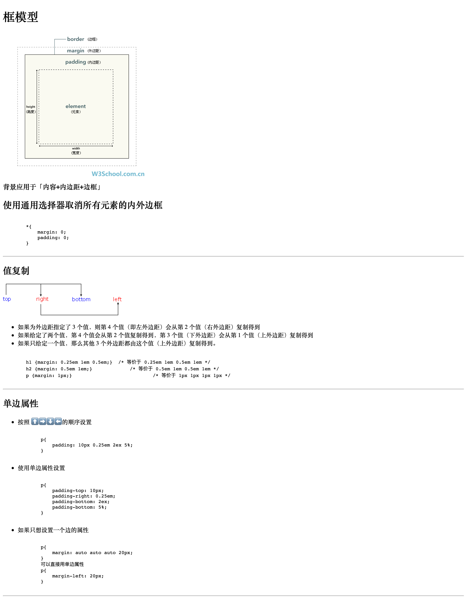

# CSS 框模型

Table of Contents
=================

   * [CSS 框模型](#css-框模型)
      * [框模型简介](#框模型简介)
      * [padding 内边距](#padding-内边距)
      * [border 边框](#border-边框)
      * [margin 外边框](#margin-外边框)

## 框模型简介

## padding 内边距

## border 边框

## margin 外边框

