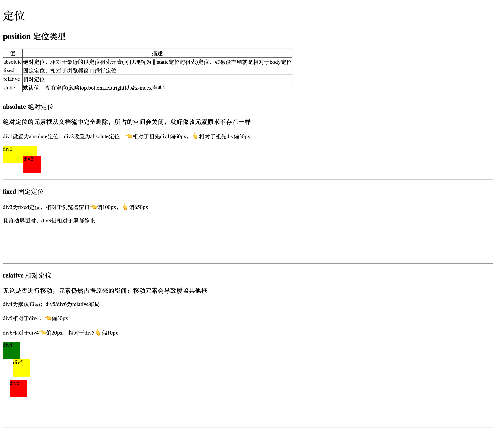
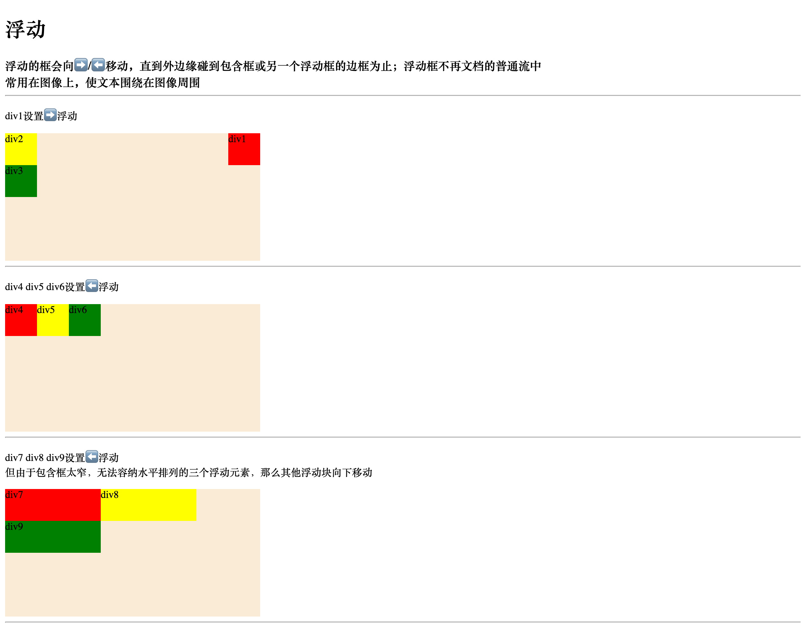
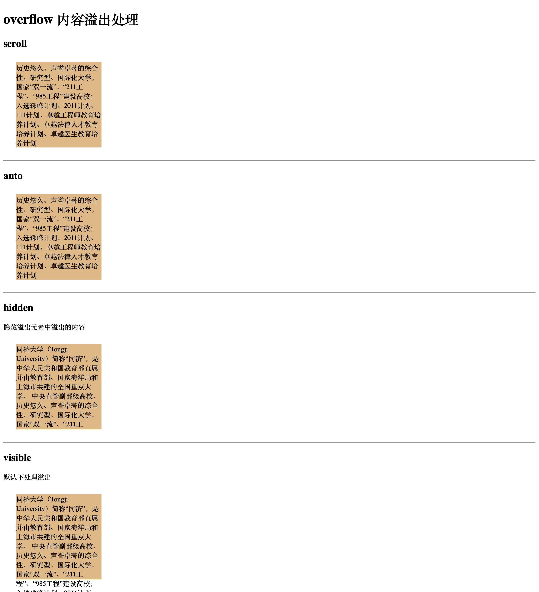
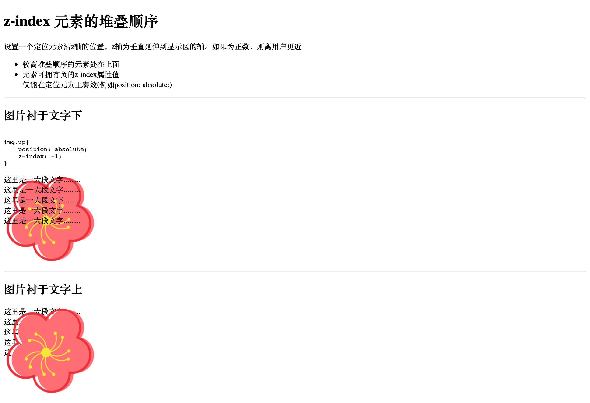

# CSS 浮动float

Table of Contents
=================

   * [CSS 浮动float](#css-浮动float)
      * [position 定位(绝对定位/固定定位/相对定位)](#position-定位绝对定位固定定位相对定位)
      * [float 浮动](#float-浮动)
         * [图像浮于段落右侧](#图像浮于段落右侧)
         * [段落首字母浮于段落左侧](#段落首字母浮于段落左侧)
         * [用列表创建水平菜单](#用列表创建水平菜单)
      * [溢出处理](#溢出处理)
      * [z-index 堆叠顺序](#z-index-堆叠顺序)
      * [clip 设置元素的形状](#clip-设置元素的形状)
      
      

## position 定位(绝对定位/固定定位/相对定位)

## float 浮动

### 图像浮于段落右侧

### 段落首字母浮于段落左侧

### 用列表创建水平菜单

## 溢出处理

## z-index 堆叠顺序

## clip 设置元素的形状

