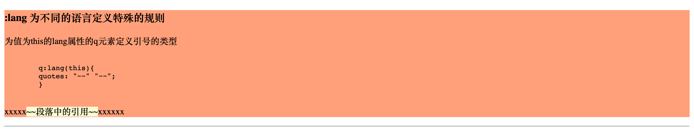

# 伪类 & 伪元素

Table of Contents
=================

   * [伪类 &amp; 伪元素](#伪类--伪元素)
      * [锚伪类](#锚伪类)
      * [:first-child 首个子对象生效](#first-child-首个子对象生效)
      * [:lang 为不同的语言定义特殊的规则](#lang-为不同的语言定义特殊的规则)
      * [:before/:after 在元素的内容之前/之后插入新内容](#beforeafter-在元素的内容之前之后插入新内容)
      * [:focus 当输入框获取焦点时](#focus-当输入框获取焦点时)
      * [:first-line 文本的首行](#first-line-文本的首行)
      * [:first-letter 文本的首字母](#first-letter-文本的首字母)
      
      

## 锚伪类

## :first-child 首个子对象生效

## :lang 为不同的语言定义特殊的规则

## :before/:after 在元素的内容之前/之后插入新内容

## :focus 当输入框获取焦点时

## :first-line 文本的首行

## :first-letter 文本的首字母

