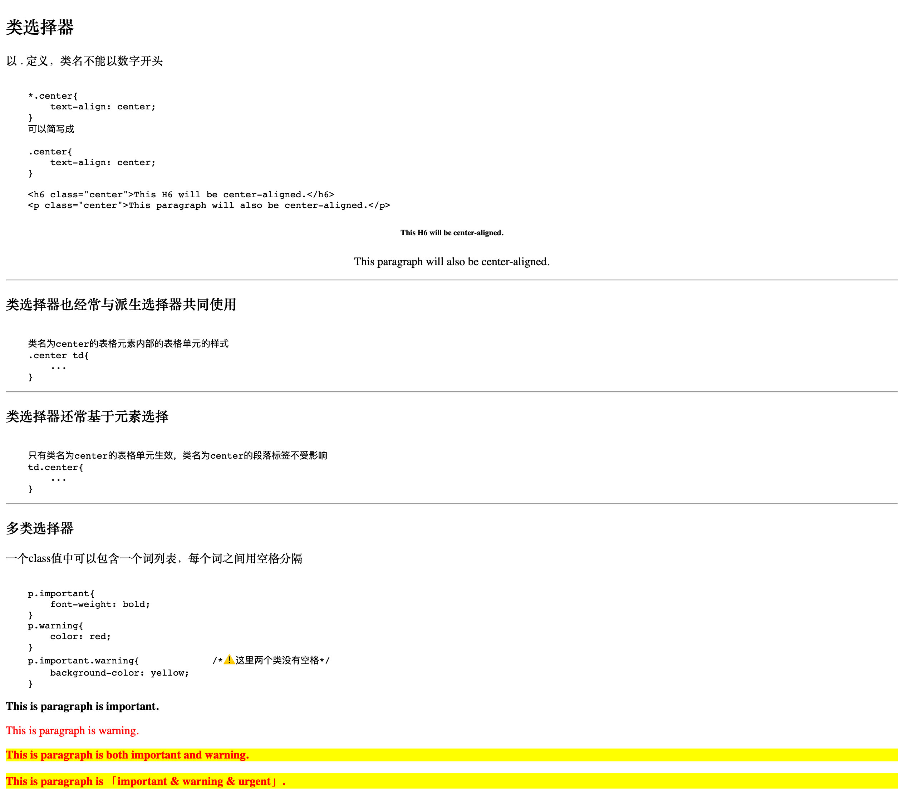

# Selector 选择器

Table of Contents
=================

   * [Selector 选择器](#selector-选择器)
      * [id选择器](#id选择器)
      * [class类选择器](#class类选择器)
      * [类型选择器](#类型选择器)
      * [属性选择器](#属性选择器)
      * [后代选择器](#后代选择器)
      * [子元素选择器](#子元素选择器)
      * [相邻兄弟选择器](#相邻兄弟选择器)
      
      

## id选择器

## class类选择器

## 类型选择器

## 属性选择器

## 后代选择器

## 子元素选择器

## 相邻兄弟选择器

