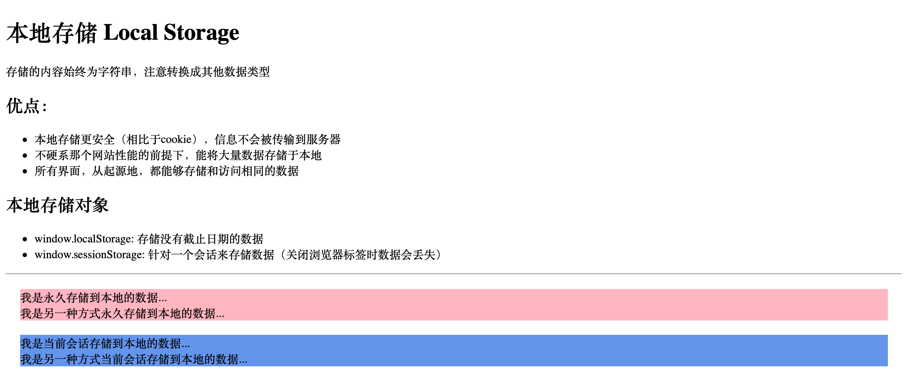

# HTML5 API

- [地理定位 Geolocation](#geolocation)
- [拖放 Drag & Drop](#drag&drop)
- [本地存储 Local Storage](#LocalStorage)
- [应用程序缓存 Application Cache](#ApplicationCache)

## 拖放

## 本地存储 Local Storage

## 应用程序缓存 Application Cache

