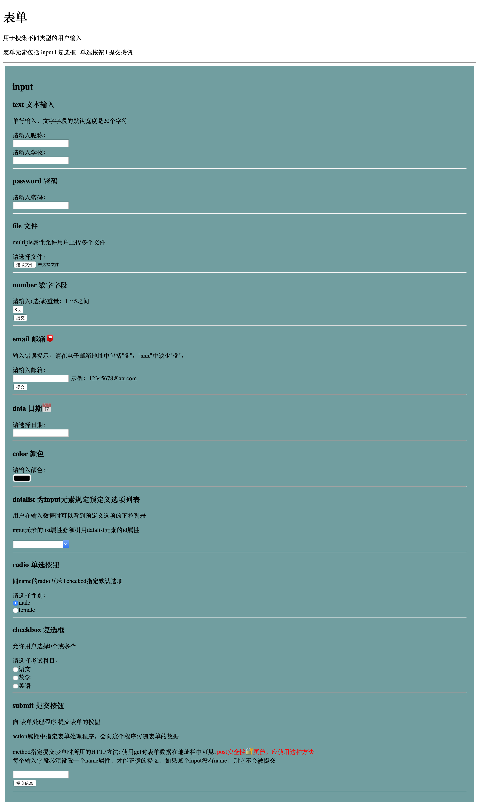
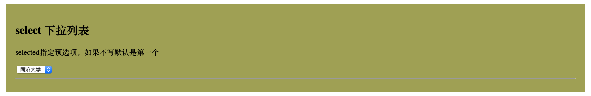
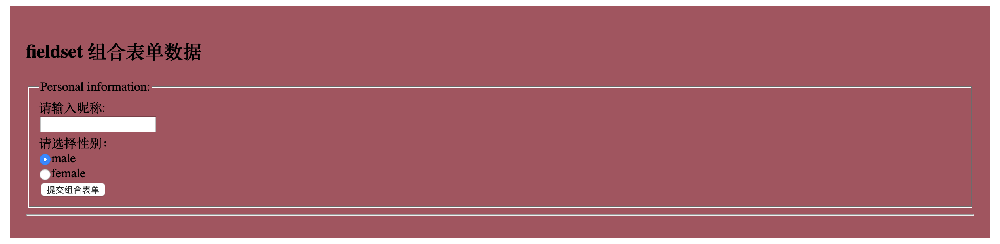

# Form 表单知识点

## 目录

- [input 输入框 单选/复选框 提交按钮](#input)

- [select 下拉列表](#select)

- [textarea 文本域](#textarea)

- [button 按钮](#button)

- [range 滑动条](#range)

- [filedset 组合表单数据](#fileset)

  

## input 输入框 单选/复选框 提交按钮

## select 下拉列表

## textarea 文本域

## button 按钮

## range 滑动条

## filedset 组合表单数据

