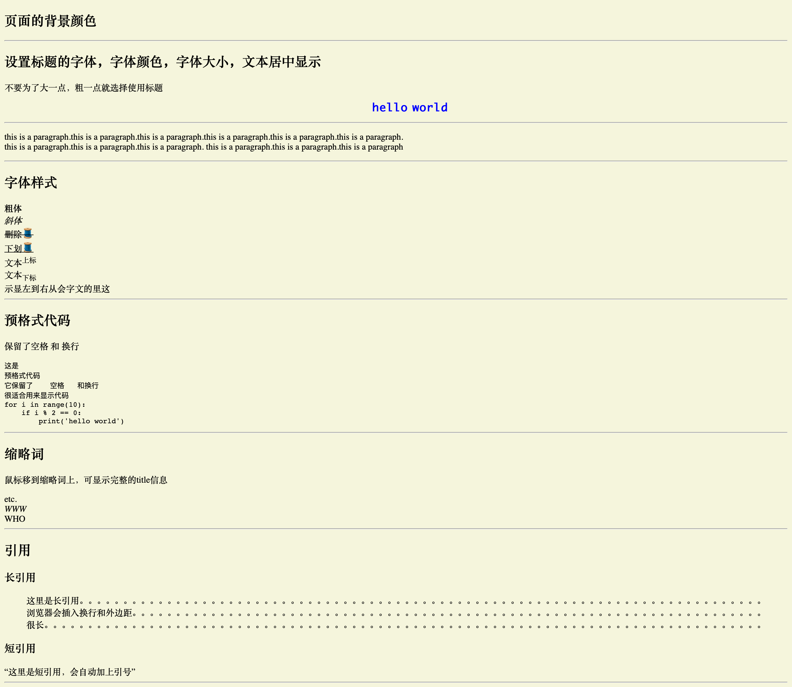
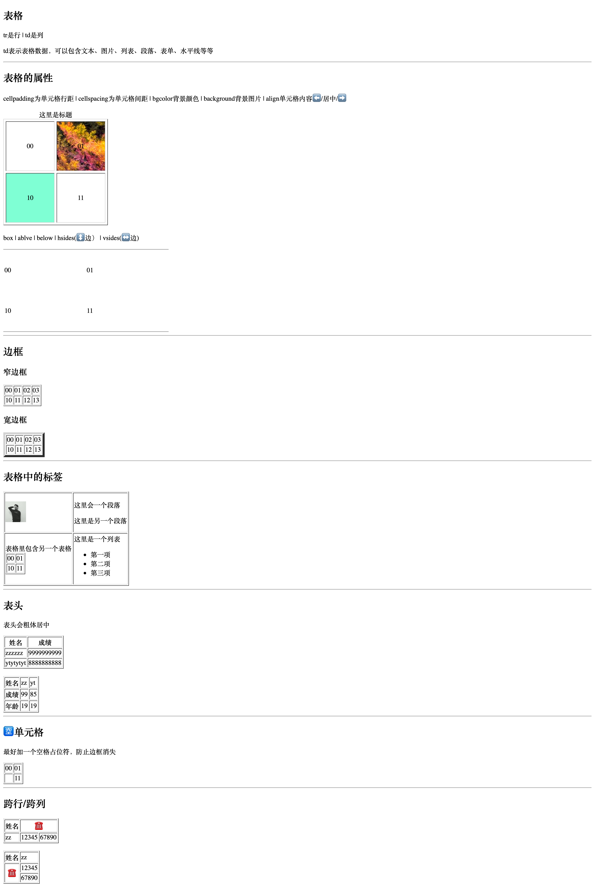
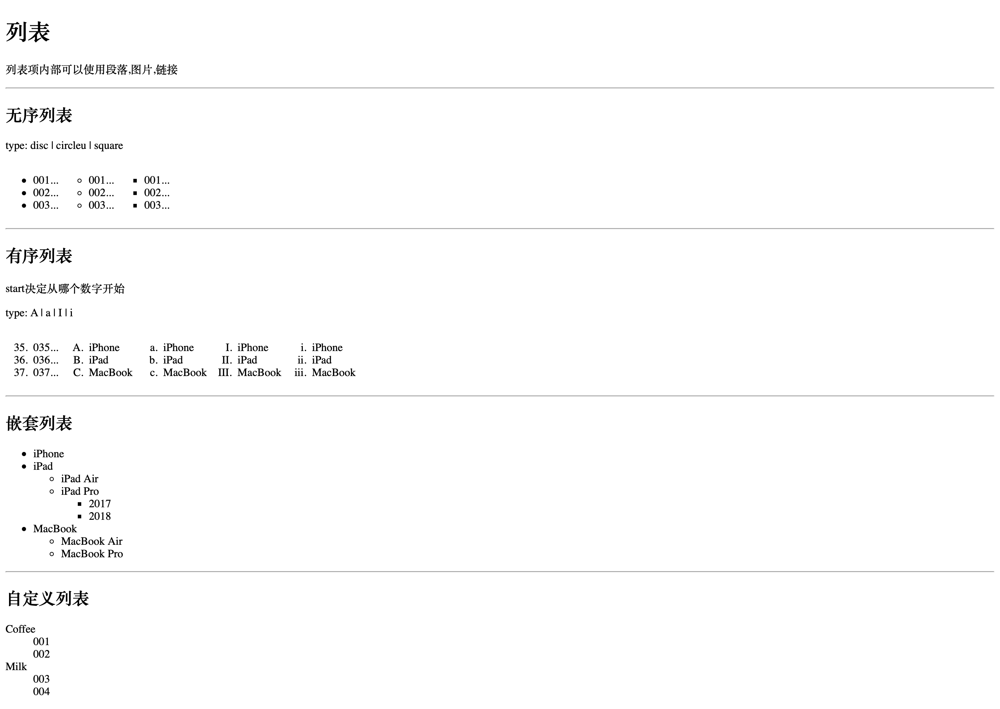
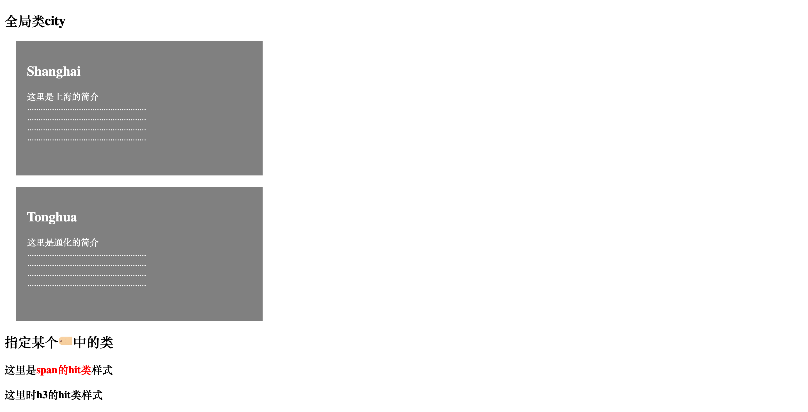
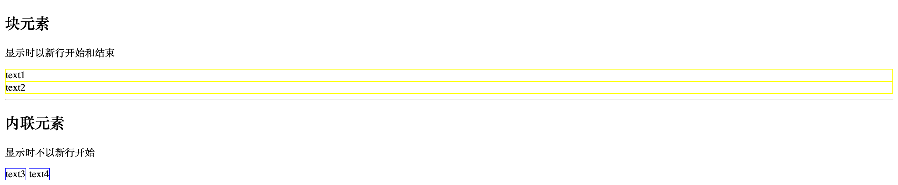
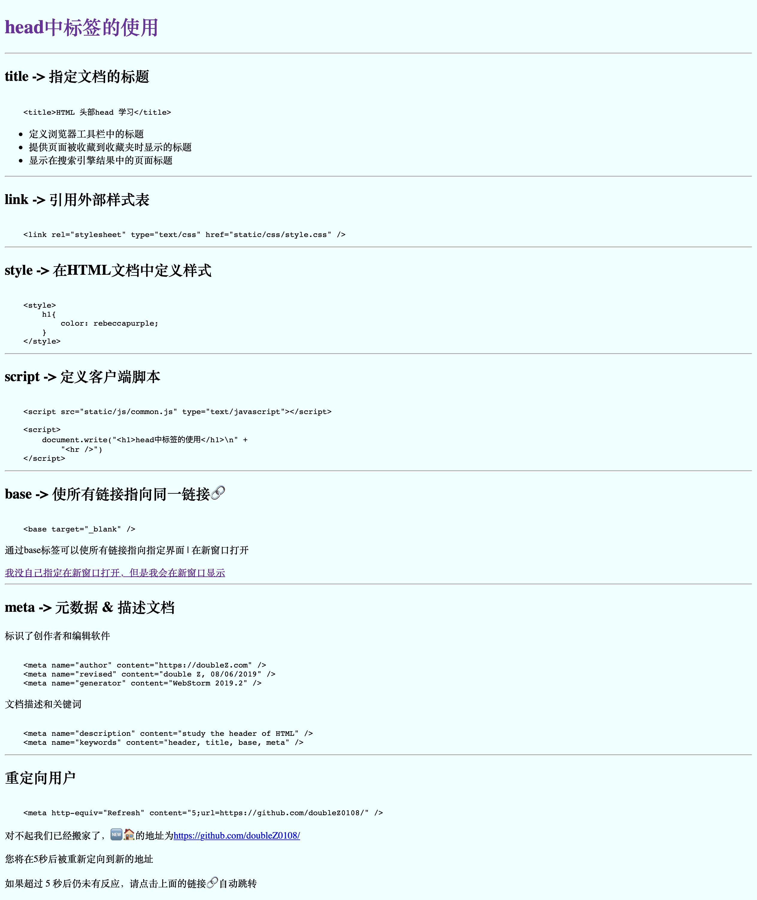

# HTML 知识点

## 目录

- [text 文本信息](#text)
- [img 图片](#img)
- [link 链接🔗](#link)
- [table 表格](#table)
- [css 样式](#css)
- [list 列表](#list)
- [class 类(样式)](#class)
- [block & inline 块元素和内联元素](#block&inline)
- [head 中的标签(title/link/style/script/base/meta)](#head)
- [Entity Characters 实体字符](#EntityCharacters)
- [HTML5 新特性](#HTML5)
- [figure figcaption 为图片添加标题(可见的解释)](#figure_figcaption)
- [HTML5 样式指南和代码规定](#guide)

## text 文本信息

## img 图片

## link 链接🔗

## table 表格

## css 样式

## list 列表

## class 类(样式)

## block & inline 块元素和内联元素

## head 中的标签(title/link/style/script/base/meta)

## Entity Characters 实体字符

## HTML5 新特性

## figure figcaption 为图片添加标题(可见的解释)

## HTML5 样式指南和代码规定

