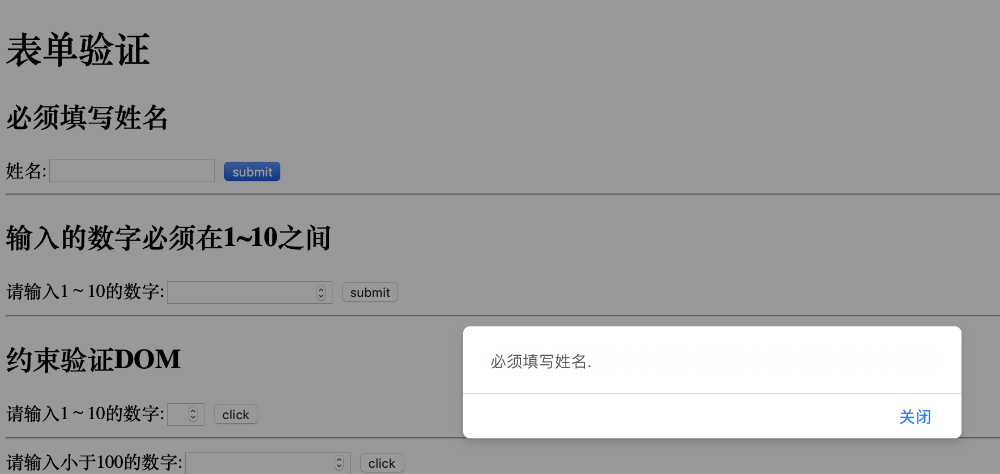

# JavaScript 表单验证

Table of Contents
=================

   * [JavaScript 表单验证](#javascript-表单验证)
      * [手动判断数字的合法性](#手动判断数字的合法性)
      * [手动判断数字的合法性](#手动判断数字的合法性-1)
      * [约束验证DOM](#约束验证dom)
         * [浏览器自己写的错误提示](#浏览器自己写的错误提示)
         * [自定义的错误提示](#自定义的错误提示)
         
         

## 手动判断数字的合法性

## 手动判断数字的合法性

## 约束验证DOM

### 浏览器自己写的错误提示

### 自定义的错误提示

